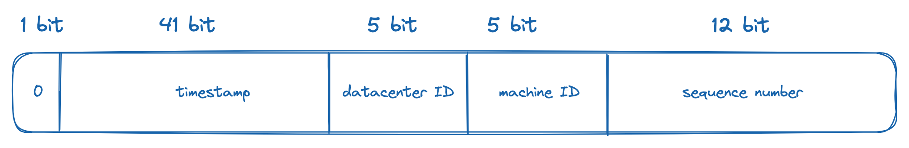

# Unique ID Generator

## Purpose : 

Build a unique ID generator which can fit in a distributed environment.

## Requirements :

- IDs must be unique
- IDs must be numerical values
- IDs must fit in 64 bits
- IDs are ordered by dates
- Ability to generator over 10 000 unique ids per second

## Approach (Twitter Snowflake):

### Timestamp

### Datacenter & Machine id

A number defined at startup

### Sequence number

A number incremented by 1  which is reset after every 1ms